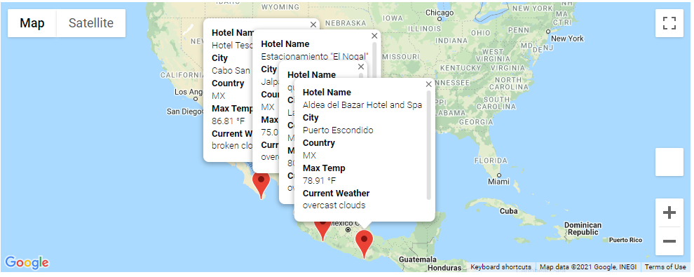
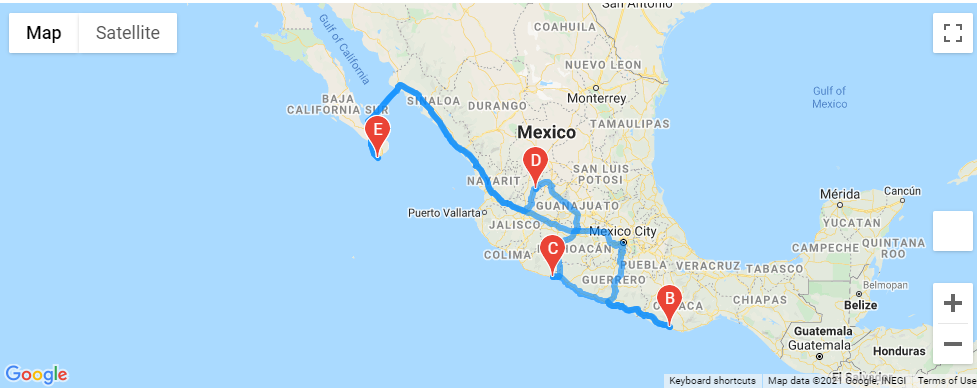

# World_Weather_Analysis
The objective of this exercise was to conduct three separate analyses on to provide:

- Retreive Weather Data
    To visualize cities around the globe to display certain temperatures, heat maps, winds speeds, etc.
- Create a potential Customer Travel Destination Map
    Introduce customer-centric information around potential vacation destinations based on weather temperature preferences.
- Create a Travel Itinerary based on Itinerary Map
    Map out a suggested, drive-able route based on suggested locales and on customer weather criteria.

The first deliverable was to create a random set of latitudes and longitudes.  From that set of data, I was able to perform an API call within the OpenWeatherMap to where I took the live data from the site and created a comprehensive list of cities.  

From the list of those cities, data was further gathered to display maximum temperature, humidity, cloudiness, wind speed and a brief weather description.  This data will involve a comprehensive step

Deliverable two was to request user preferred weather temperatures as input (regarding their vacation destinations) and clean the rest of the data.  This is in preparation for displaying visualizations for the recommended cities and countries.  

For this task I needed to utilize an additional API call, however, this time it was for Google Mapping data.  Taking the randomly selected cities, I was able to extrapolate suggested Hotel Names within those cities.

With some additional coding and data wrangling, I was able to create maps with markers of different cities that met the user criteria.  In addition, I've added clickable markers on the Google maps will display the suggested Hotel Name, City, Country and Current Weather descriptions as seen below.

## Figure 1

The third deliverable was to create a potential driveable travel itinerary map for the user.  From the cleaned and sorted data provided above, it was merged together to create this drive-able map.  The map has four suggested destinations within the same country and the suggested drive guide to each destination as seen below.

## Summary
To conclude, this module was quite challenging as there were many components to these required deliverables.  It was amazing to utilize the live data from both the OpenWeather and Google Cloud platforms to be able to deliver stunning yet simple displays.  I appreciate the fact that I'm still maturing my understanding to code in many different ways, utilizing different tools, and modification of displays for each specific client.  

The third deliverable was the most difficult challenge.  As I get more familiar with Python, I will be able to get a better understanding of which commands, functions and methods to use in order to manipulate the data.

